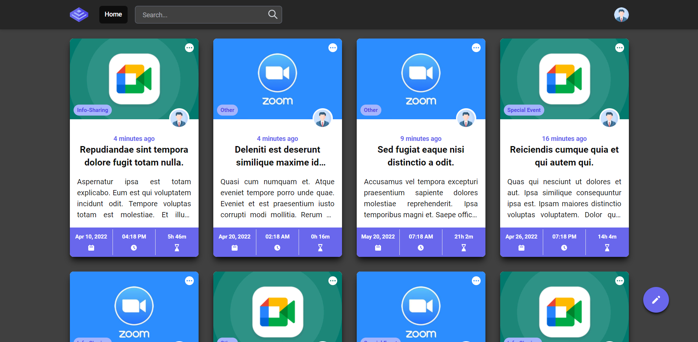

# laravel_deeper_training_project

### Description
 This is a Laravel Project trained by my Senior [Thet Min Htun](https://github.com/thetminnhtun-scm).
 
 Online Meeting can be easily managed by this project. 

### Facebook Login, Google Login


---------------------------------------------

### Meeting Management


### Installation

Clone the repo locally:
```
git pull https://github.com/Shadow-Beast/laravel_deeper_training_project.git

cd laravel_deeper_training_project
```

Install PHP dependencies:
```
composer install
```

Install NPM dependencies:
```
npm install
```

Build assets:
```
npm run dev
```

Run database mirgrations and seeders:
```
php artisan migrate:fresh --seed
```

(Optional) Get dummy data:
```
php artisan migrate:fresh --seed
```

Run NPM for design:
```
npm run watch
```

Login as SuperAdmin:
```
email: admin@admin.com
password: password
```